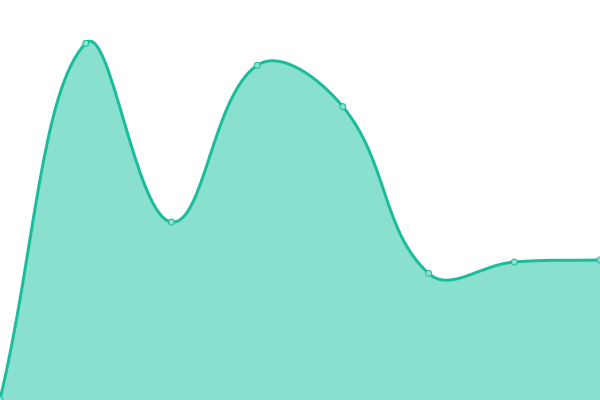
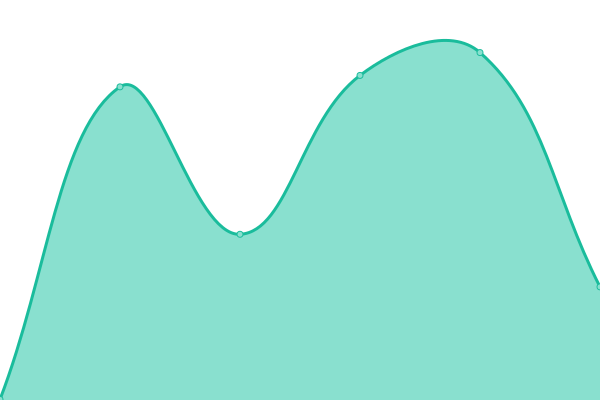
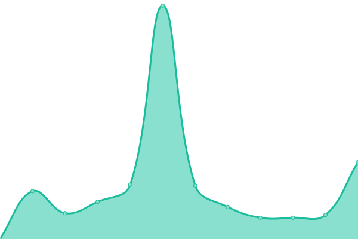

# [📈 Live Status](https://lei-splashtop.github.io/sep-uptime): <!--live status--> **🟧 Partial outage**

This repository contains the open-source uptime monitor and status page for [Lei Zhang](https://lei-splashtop.github.io/sep-uptime), powered by [Upptime](https://github.com/upptime/upptime).

With [Upptime](https://upptime.js.org), you can get your own unlimited and free uptime monitor and status page, powered entirely by a GitHub repository. We use [Issues](https://github.com/lei-splashtop/sep-uptime/issues) as incident reports, [Actions](https://github.com/lei-splashtop/sep-uptime/actions) as uptime monitors, and [Pages](https://lei-splashtop.github.io/sep-uptime) for the status page.

<!--start: status pages-->
<!-- This summary is generated by Upptime (https://github.com/upptime/upptime) -->
<!-- Do not edit this manually, your changes will be overwritten -->
<!-- prettier-ignore -->
| URL | Status | History | Response Time | Uptime |
| --- | ------ | ------- | ------------- | ------ |
|  [SplashVault-dev](https://dev.pwm.splashshield.ai/#!/) | 🟩 Up | [splash-vault-dev.yml](https://github.com/lei-splashtop/sep-uptime/commits/HEAD/history/splash-vault-dev.yml) | 

 330ms
     
 | 

<a href="https://sep-uptime.splashshield.ai/history/splash-vault-dev">100.00%</a>
    

|  [SDP-dev](https://dev-spd-cluster.splashshield.ai/login) | 🟥 Down | [sdp-dev.yml](https://github.com/lei-splashtop/sep-uptime/commits/HEAD/history/sdp-dev.yml) | 

 340ms
     
 | 

<a href="https://sep-uptime.splashshield.ai/history/sdp-dev">0.00%</a>
    

|  [Grafana-dev](https://loki.dev.splashshield.ai/) | 🟩 Up | [grafana-dev.yml](https://github.com/lei-splashtop/sep-uptime/commits/HEAD/history/grafana-dev.yml) | 

 13413ms
     
 | 

<a href="https://sep-uptime.splashshield.ai/history/grafana-dev">93.88%</a>
    

|  [SplashVault-stage](https://vault.stage.splashshield.ai/) | 🟩 Up | [splash-vault-stage.yml](https://github.com/lei-splashtop/sep-uptime/commits/HEAD/history/splash-vault-stage.yml) | 

 465ms
     
 | 

<a href="https://sep-uptime.splashshield.ai/history/splash-vault-stage">100.00%</a>
    

|  [SDP-stage](https://gate.stage.splashshield.ai/) | 🟩 Up | [sdp-stage.yml](https://github.com/lei-splashtop/sep-uptime/commits/HEAD/history/sdp-stage.yml) | 

 477ms
     
 | 

<a href="https://sep-uptime.splashshield.ai/history/sdp-stage">100.00%</a>
    

|  [Grafana-stage](https://devops.controller1-us-west-2.stage.splashshield.ai/grafana/) | 🟥 Down | [grafana-stage.yml](https://github.com/lei-splashtop/sep-uptime/commits/HEAD/history/grafana-stage.yml) | 

 0ms
     
 | 

<a href="https://sep-uptime.splashshield.ai/history/grafana-stage">0.00%</a>
    

|  [Assets](http://splashlock-assets.splashshield.ai/) | 🟩 Up | [assets.yml](https://github.com/lei-splashtop/sep-uptime/commits/HEAD/history/assets.yml) | 

 361ms
     
 | 

<a href="https://sep-uptime.splashshield.ai/history/assets">100.00%</a>
    

<!--end: status pages-->

[**Visit our status website →**](https://lei-splashtop.github.io/sep-uptime)

## 📄 License

- Powered by: [Upptime](https://github.com/upptime/upptime)
- Code: [MIT](./LICENSE) © [Lei Zhang](https://lei-splashtop.github.io/sep-uptime)
- Data in the `./history` directory: [Open Database License](https://opendatacommons.org/licenses/odbl/1-0/)
